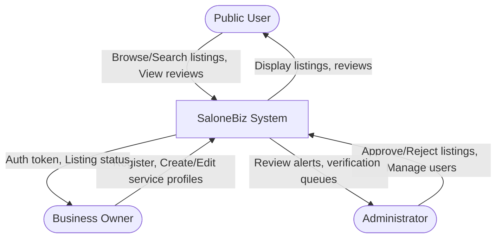
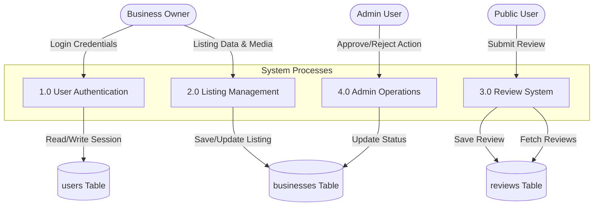
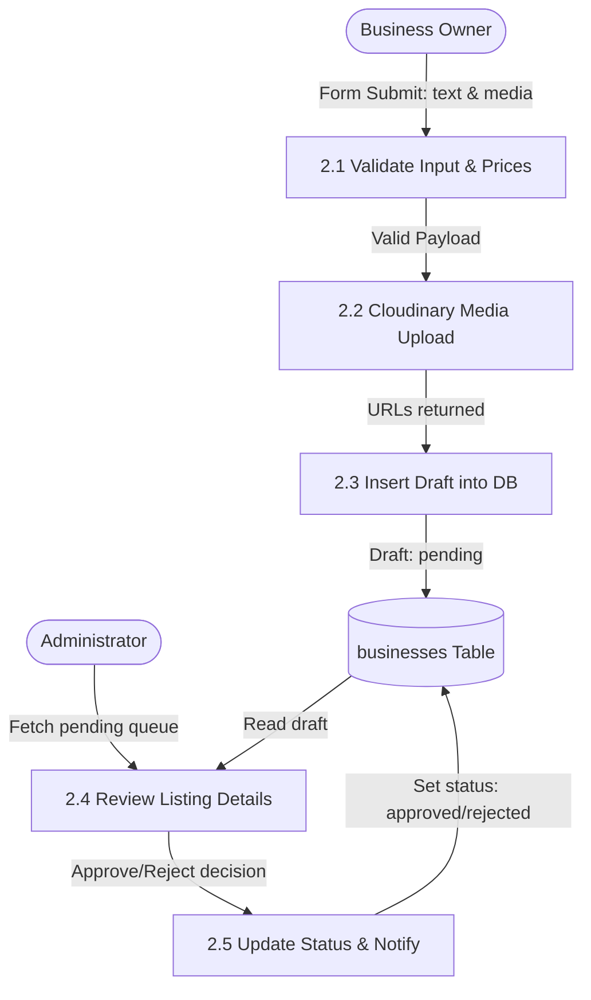
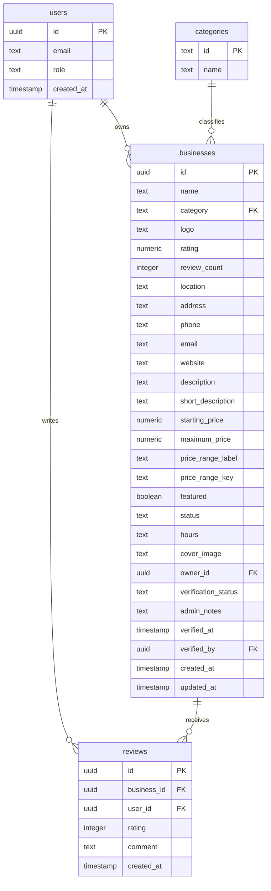
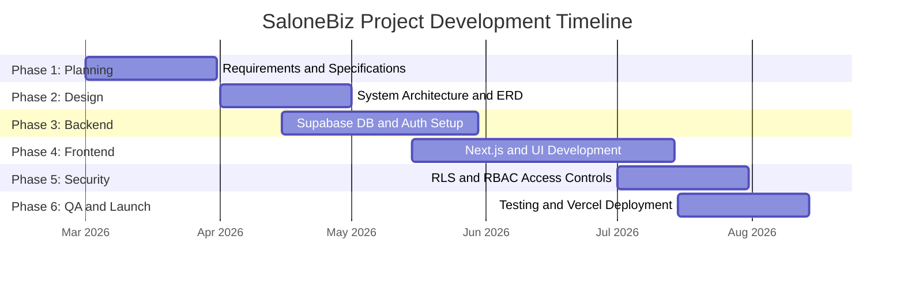
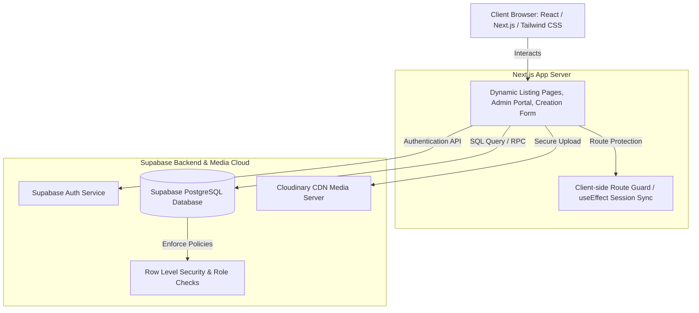
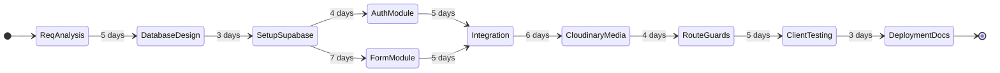

# SaloneBiz: A Digital Business Directory and Marketplace Platform for Sierra Leone

**Student Name:** George Alvin Macarthy  
**Enrolment No.:** [Insert Enrolment No.]  
**Guide/Supervisor:** [Insert Supervisor Name]  
**Institution:** IMATT College, Freetown, Sierra Leone  

---

## 1. INTRODUCTION

### Problem Statement
In Sierra Leone, the local commerce sector faces a major visibility challenge. Small, medium, and large service providers (such as local tech firms, automotive workshops, construction contractors, medical consultants, hotels, and retail shops) rely heavily on word-of-mouth recommendations. Public consumers lack a centralized, verified digital reference to discover, contact, and check reviews for registered businesses. Conversely, local business owners do not have a cost-effective, premium digital medium to showcase their services, publish promotional media, and build client trust. Existing manual practices lead to fragmented consumer searches, high verification overhead, and low digital marketplace participation.

### Proposed Solution
**SaloneBiz** is a responsive, single-page-application-driven business directory and marketplace platform engineered to bridge the gap between service providers and local consumers in Sierra Leone. Built on the Next.js App Router architecture and backed by Supabase Serverless Postgres, the system allows business owners to register professional listings, upload promotional images/videos via Cloudinary CDN, and include contact channels (such as phone numbers and direct WhatsApp chat links). It provides consumers with interactive filters, reviews, and ratings. 

### Significance
By digitizing the listing verification workflow through a secure Admin Portal, SaloneBiz ensures the credibility of listed providers. The integration of direct WhatsApp links matches the dominant smartphone communication patterns in Sierra Leone, offering a friction-free communication channel. This platform promotes digital inclusivity, increases merchant earnings, and reduces search costs for consumers in the local economy.

---

## 2. OBJECTIVES

### Primary Objective
To design, develop, and deploy a secure, responsive, and verified business directory and marketplace platform that empowers service providers in Sierra Leone to list their businesses online and allows consumers to easily discover and verify local services.

### Secondary Objectives
- **Authentication & Authorization:** Implement robust Role-Based Access Control (RBAC) separating public users, business owners, and administrators.
- **Media Optimization:** Streamline promotional image and video uploads utilizing Cloudinary's unsigned presets and responsive CDN delivery.
- **Direct Interaction:** Integrate instant, formatted WhatsApp link generation using standard phone numbers to bypass traditional, costly communication barriers.
- **Administrative Control:** Create a clean admin review dashboard enabling administrators to approve, reject, or comment on registered listing drafts before they are visible to the public.

---

## 3. LITERATURE REVIEW

### Comparison Table of Existing Systems

| Feature / Criteria | Yellow Pages (Traditional) | Facebook Pages / Groups | SaloneBiz (Proposed) |
| :--- | :--- | :--- | :--- |
| **Centralization** | Low (Spread across physical print / legacy sites) | Low (Scattered across social feeds) | **High** (Single dedicated portal) |
| **Verification & Trust** | Manual, static (High outdated listings) | No formal verification (High spam profiles) | **High** (Mandatory admin review queue) |
| **Media Richness** | Text only / Static images | High (User upload, unoptimized size) | **High** (Optimized Cloudinary images/videos) |
| **Local Integration** | Phone numbers only | Direct messaging (Requires Facebook account) | **WhatsApp Direct Link & Direct Calls** |
| **Searchability** | Poor (Clunky alphabetical indexes) | Limited to keyword algorithms | **High** (Structured category filters) |

### Research Gap
Existing social media pages and legacy directory platforms lack mandatory, structured admin verification workflows, resulting in listings that are either outdated or fraudulent. Furthermore, legacy systems do not offer optimized media pipelines or instant messaging fallbacks tailored for mobile-first developing markets like Sierra Leone. SaloneBiz fills this research gap by providing a verification pipeline, structural categorization, and direct WhatsApp integrations.

---

## 4. SYSTEM REQUIREMENTS

### Functional Requirements
1. **User Authentication:** Sign up, sign in, and session management using Supabase Auth.
2. **Profile Creation:** Differentiated user dashboards for managing business listings and submitting client reviews.
3. **Listing Form:** Upload logo, product showcase image, promotional video (Cloudinary), specify locations, email, phone, business hours, and starting price.
4. **Admin Queue:** Validation queues displaying pending listing details, allowing comments, and changing verification status (`approved`, `rejected`, `pending`).
5. **Rating & Reviews:** Public users can submit numeric ratings (1-5 stars) and comments on approved business profiles.

### Non-Functional Requirements
1. **Security:** Secure authorization using client-side router guards, database Row Level Security (RLS) policies, and input sanitation.
2. **Responsiveness:** Fluid grid columns and responsive visual styling (`object-contain` aspect ratios) optimized for both desktop and mobile screens.
3. **SEO Protection:** Automatic search crawler restriction (`noindex, nofollow`) for administrative paths.
4. **Performance:** Efficient client state queries utilizing cached Supabase singletons to prevent resource overhead.

### Hardware & Software Requirements
- **Development Environment OS:** Windows 10/11
- **Runtime Environment:** Node.js (v18+) & NPM
- **Framework & Libraries:** Next.js (App Router), Tailwind CSS, TypeScript, Supabase Client SDK, Cloudinary Upload API
- **Cloud Backend:** Supabase (Database & Authentication), Cloudinary (CDN Media Hosting)

---

## 5. SYSTEM ANALYSIS

### DFD Level 0 (Context Diagram)
The Context Diagram represents the core boundaries of the SaloneBiz system, showing the data flows between the external entities (User, Business Owner, Admin) and the centralized platform.



### DFD Level 1 (Data Flow Diagram - Processes)
The Level 1 DFD decomposes the system into four major processes: User Authentication, Listing Management, Review System, and Administrative Operations.



### DFD Level 2 (Listing Creation & Approval Detail)
The Level 2 DFD details the listing creation flow, media uploading, and validation processes.



### Entity Relationship Diagram (ERD)
The entity relationships highlight how user profiles, classifications, business listings, and reviews associate.



### Use Case Diagram
The Use Case diagram visualizes the scope of actions available to the public user, the business owner, and the administrator.

```mermaid
leftToRightDirection
graph TD
    PublicUser((Public User))
    BizOwner((Business Owner))
    AdminUser((Admin User))
    
    UC1(Browse & Search Listings)
    UC2(View Reviews & Ratings)
    UC3(Create/Register Account)
    UC4(Add/Edit Business Listings)
    UC5(Upload Images & Videos)
    UC6(Submit Customer Reviews)
    UC7(Verify Business Listings)
    UC8(Manage Users & System Roles)
    
    PublicUser --> UC1
    PublicUser --> UC2
    PublicUser --> UC3
    PublicUser --> UC6
    
    BizOwner --> UC3
    BizOwner --> UC4
    BizOwner --> UC5
    BizOwner --> UC1
    
    AdminUser --> UC7
    AdminUser --> UC8
    AdminUser --> UC1
```

### Gantt Chart (Project Schedule)
The project scheduling outlines key milestones from requirement gathering to deployment.



### System Architecture
The application runs on a three-tier serverless decoupled architecture.



---

## 6. SYSTEM DESIGN

### Normalized SQL Schemas

```sql
-- 1. Users Profile Table
CREATE TABLE public.users (
  id UUID PRIMARY KEY,
  email TEXT NOT NULL UNIQUE,
  role TEXT NOT NULL DEFAULT 'user' CHECK (role IN ('user', 'business_owner', 'admin')),
  created_at TIMESTAMP WITH TIME ZONE DEFAULT CURRENT_TIMESTAMP
);

-- 2. Categories Classification Table
CREATE TABLE public.categories (
  id TEXT PRIMARY KEY,
  name TEXT NOT NULL
);

-- 3. Businesses Directory Table
CREATE TABLE public.businesses (
  id UUID PRIMARY KEY DEFAULT uuid_generate_v4(),
  name TEXT NOT NULL,
  category TEXT NOT NULL REFERENCES public.categories(id),
  logo TEXT NOT NULL,
  rating NUMERIC(3,1) DEFAULT 0,
  review_count INTEGER DEFAULT 0,
  location TEXT NOT NULL,
  address TEXT NOT NULL,
  phone TEXT NOT NULL,
  email TEXT NOT NULL,
  website TEXT,
  description TEXT NOT NULL,
  short_description TEXT,
  starting_price NUMERIC,
  maximum_price NUMERIC,
  price_range_label TEXT,
  price_range_key TEXT CHECK (price_range_key IN ('low', 'medium', 'high')),
  featured BOOLEAN DEFAULT FALSE,
  status TEXT NOT NULL DEFAULT 'active' CHECK (status IN ('active', 'inactive', 'pending')),
  hours TEXT NOT NULL,
  cover_image TEXT NOT NULL, -- Serialized JSON for Cloudinary image & video details
  owner_id UUID NOT NULL REFERENCES public.users(id) ON DELETE CASCADE,
  verification_status TEXT NOT NULL DEFAULT 'pending' CHECK (verification_status IN ('pending', 'approved', 'rejected')),
  admin_notes TEXT,
  verified_at TIMESTAMP WITH TIME ZONE,
  verified_by UUID REFERENCES public.users(id),
  created_at TIMESTAMP WITH TIME ZONE DEFAULT CURRENT_TIMESTAMP,
  updated_at TIMESTAMP WITH TIME ZONE DEFAULT CURRENT_TIMESTAMP
);

-- 4. Reviews Table
CREATE TABLE public.reviews (
  id UUID PRIMARY KEY DEFAULT uuid_generate_v4(),
  business_id UUID NOT NULL REFERENCES public.businesses(id) ON DELETE CASCADE,
  user_id UUID NOT NULL REFERENCES public.users(id) ON DELETE CASCADE,
  rating INTEGER NOT NULL CHECK (rating >= 1 AND rating <= 5),
  comment TEXT,
  created_at TIMESTAMP WITH TIME ZONE DEFAULT CURRENT_TIMESTAMP
);
```

### Module Breakdown
- **Authentication Module:** Manages Supabase signup/login, session synchronization, and caching of the client singleton to avoid multi-instance execution alerts.
- **Listing Module:** Controls directory listing submissions. Translates price fields to a simplified Starting Price field (`Starting Price (Optional)`), maps media schemas to JSON configurations inside the `cover_image` field, and triggers admin re-verification updates upon modification.
- **Verification Module:** Runs client-side `useEffect` authentication checks to authorize pages (`/admin` and `/admin-dashboard`). Keeps pages hidden and shows loading states until authentication matches `'admin'`.
- **Review Module:** Allows registered consumers to submit comments and ratings. Computes reviews and average ratings on listing display pages.

### UI/UX Wireframe Strategy
The user interface is designed with a premium, responsive architecture utilizing **Tailwind CSS**. It incorporates:
- Unified border cards (`rounded-xl border border-gray-200 shadow-sm`) that feature an `object-contain` aspect ratio for media to ensure wide landscape and tall portrait photos align correctly.
- Action-oriented components including a high-contrast green WhatsApp contact link.
- Stackable flex headers (`flex-col sm:flex-row`) ensuring a responsive experience across all screen sizes.

---

## 7. PERT CHART
The Program Evaluation and Review Technique (PERT) chart identifies the critical path and task dependency timelines.



---

## 8. SECURITY MEASURES

### Role-Based Access Control (RBAC) & Client Guards
Access limits are enforced client-side on administrative pages. By querying `supabase.auth.getUser()`, the system evaluates whether the active session belongs to an authorized `admin` profile before rendering administration dashboard metrics, routing failures back to `/admin-login` immediately.

### Row Level Security (RLS)
The database enforces strict RLS policies on tables to ensure business owners can only update their own listings, admins can review all listings, and public viewers can retrieve approved active listings.

### Cloudinary API Protection
Image and video hosting are handled using unsigned upload presets directly from client forms to Cloudinary, ensuring that sensitive Cloudinary API secret credentials remain secure on the server side and are never exposed in browser requests.

### Input Sanitization
Text fields, descriptions, and comments are sanitized prior to database submission to prevent Cross-Site Scripting (XSS) and injection vulnerabilities.

---

## 9. TESTING STRATEGY

### Unit Testing
Core functions like phone number normalization (cleaning non-digits, prepending `232`, and stripping local leading zeros for the WhatsApp URL) are isolated and tested to ensure correct outputs across diverse mobile input variations.

### Integration Testing
Validates database writes when submitting the listing form. Verifies that the JSON serialization of image/video data within the single `cover_image` field operates correctly and preserves legacy, plain-image URLs.

### Role Access Control Testing
Tests navigation guarding behavior. Confirms that logging in with standard `'user'` or `'business_owner'` accounts successfully hides the "Admin Panel" link in the navigation header and denies access to `/admin` routes.

### Mobile Responsiveness Testing
Verifies media fitting and button wrapping. Confirms that elements stack properly on smaller viewports and action buttons (like "+ Add Business") remain aligned inside responsive boundaries.

---

## 10. FUTURE SCOPE

- **Mobile Money Integration:** Introduce subscription plans for featured listings, allowing owners to pay using local mobile money APIs (Orange Money, Afrimoney).
- **Geolocation Map Directory:** Integrate leaflet maps or Mapbox APIs to display real-time physical locations and navigation routes directly on listing profile detail cards.
- **Mobile Native Application:** Utilize React Native or Flutter to compile Android and iOS versions of the directory for offline search caching and push notifications.

---

## 11. REFERENCES

1. Sommerville, I. (2015). *Software Engineering*. Pearson.
2. Elmasri, R., & Navathe, S. B. (2015). *Fundamentals of Database Systems*. Pearson.
3. Supabase Docs. (2026). *Row Level Security Policies*. Retrieved from https://supabase.com/docs
4. Next.js Documentation. (2026). *Routing & Rendering Architecture*. Retrieved from https://nextjs.org/docs
5. Cloudinary. (2026). *Direct Image and Video Uploading API*. Retrieved from https://cloudinary.com/documentation
